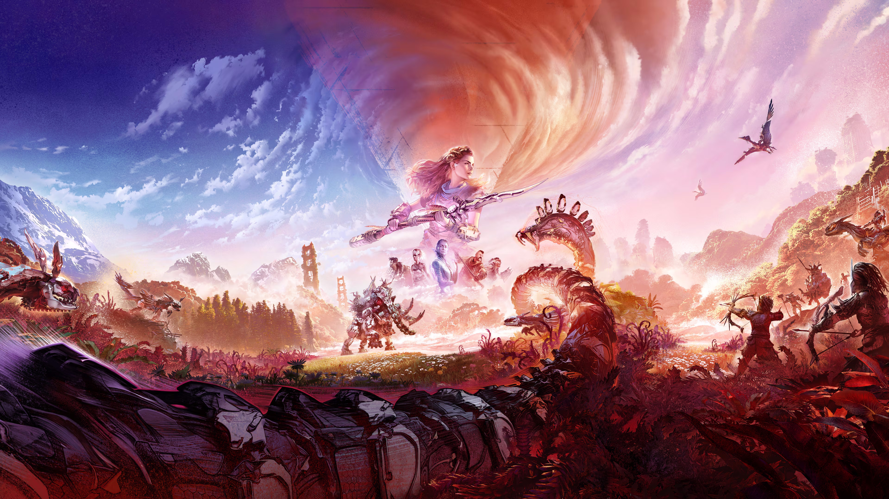
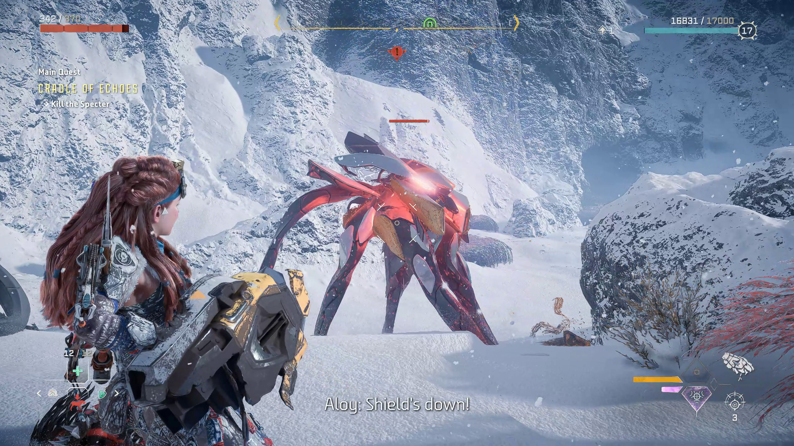

# Horizon Forbidden West 

## Horizon Forbidden West Overview

Horizon Forbidden was a action adventure game developed by Guerilla Games. It is also the sequel to 2017's Horizon Zero Dawn. The game was released in 2022 for the PS4 and PS5. Its a single player game that allows you to play as the main protagonist named Aloy in a open world environment that takes place in the year 3041 after the extinction of the human race from the robotic machines that ended them. Playing as Aloy she travels to the forbidden west to stop a mysterious threat that can destroy life on Earth again. The open world of this game is filled with different environments and biomes such as deserts, mountains, snowy terrain, beaches, forests, underwater environments, and destroyed civilizations such as the city of San Francisco and a post apocalyptic Las Vegas, Nevada. 

![[Horizon-Forbidden-WestGP2.jpg]]

## Gameplay

Horizon Forbidden West is played from a third player perspective that combines exploration, combat, and role-playing elements in a huge open world environment. Players are able to control Aloy as she travels through diverse environments, alongside completing story missions, and optional side quests. Horizon Forbidden West encourages exploration by rewarding players with new or upgraded equipment, armor, weapons, and more. Combat in this game focuses on strategy, precision, and skill instead of simple attacks on enemies. Aloy gets to use a variety of weapons such as a bow, traps, slings, spike throwers, and a futuristic weapon called the spectator gauntlet. (Shown on the third image below). These weapons are used against robotic machines and human enemies. Players are able to explore underwater, climb mountains, glide using as shield wing glider, and fly using a robotic machine, overall improving the exploration and mobility of the game to make it more dynamic. 

## Reasons Why I Like This Game

I enjoy this game because of the open environment because it offered a lot of places to explore. The increase customization of weapons made it a better game for me, and it improved a lot of aspects of the first game Zero Dawn. 

![[ZenithWP.jpg]]

## Related Pages

- [[Horizon Zero Dawn]]
- [[action-adventure/index|Action Adventure Games]]
- [[Sonic X Shadow Generations]]
- [[Stellar Blade]]
- [[Astro Bot]]
- [[007 First Light (2026)]]
- [[Super Mario Odyssey]]

